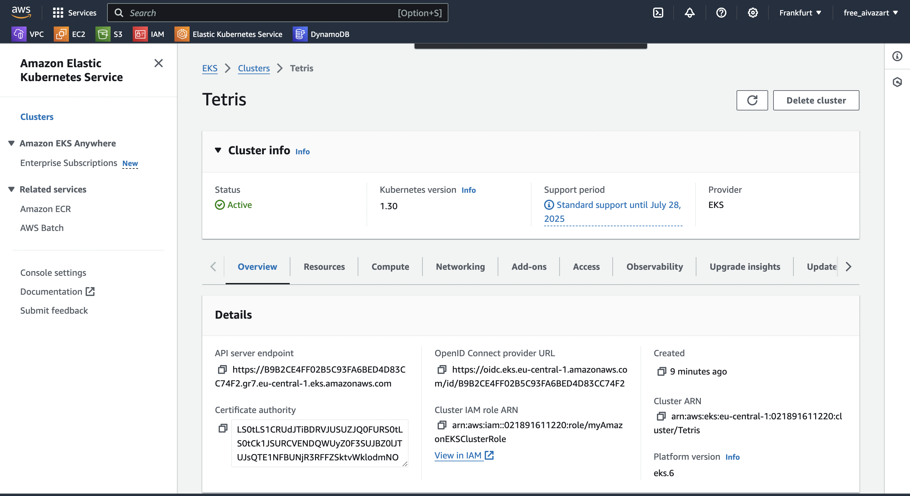
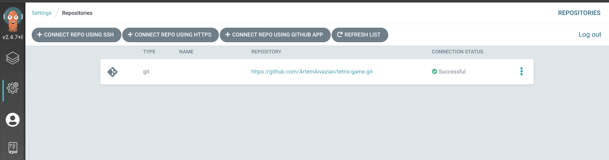
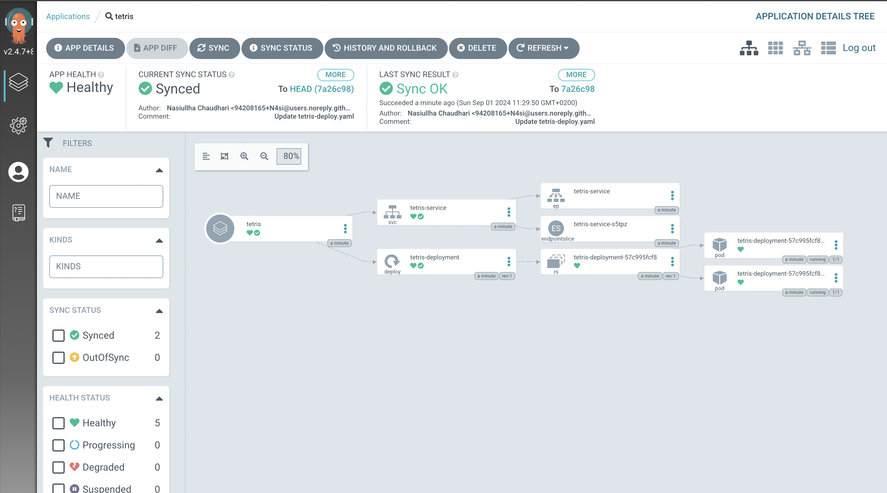

## Kubernetes
1. **Launch EKS cluster**

2. **Add Node Group**

3. **Set up context**
```bash
aws eks update-kubeconfig --name Tetris --region eu-central-1
```
4. **Install ArgoCD:**
    You can install ArgoCD on your Kubernetes cluster by following the instructions provided in the [EKS Workshop](https://archive.eksworkshop.com/intermediate/290_argocd/install/) documentation.

5. **Set Your GitHub Repository as a Source:**
    After installing ArgoCD, you need to set up your GitHub repository as a source for your application deployment. This typically involves configuring the connection to your repository and defining the source for your ArgoCD application. The specific steps will depend on your setup and requirements.

   Connect GitHub Repository:
   

6. **Create an ArgoCD Application:**
   - `name`: Set the name for your application.
   - `destination`: Define the destination where your application should be deployed.
   - `project`: Specify the project the application belongs to.
   - `source`: Set the source of your application, including the GitHub repository URL, revision, and the path to the application within the repository.
   - `syncPolicy`: Configure the sync policy, including automatic syncing, pruning, and self-healing.
  
  ArgoCD Application:
  ```yml
  apiVersion: argoproj.io/v1alpha1
  kind: Application
  metadata:
    name: tetris
  spec:
    destination:
      name: ''
      namespace: default
      server: 'https://kubernetes.default.svc'
    source:
      path: manifests
      repoURL: 'https://github.com/ArtemAivazian/tetris-game.git'
      targetRevision: HEAD
    project: default
    syncPolicy:
      automated:
        prune: false
        selfHeal: false
  ```
  