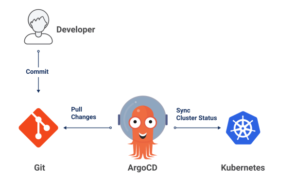
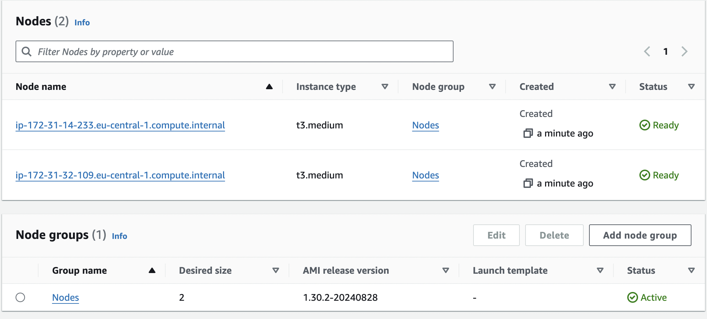
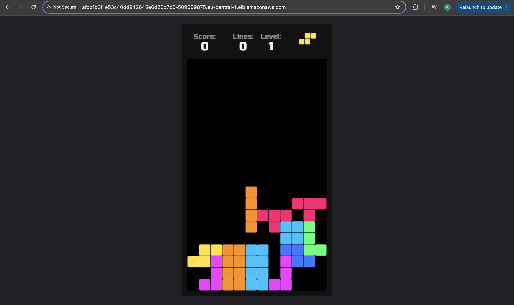
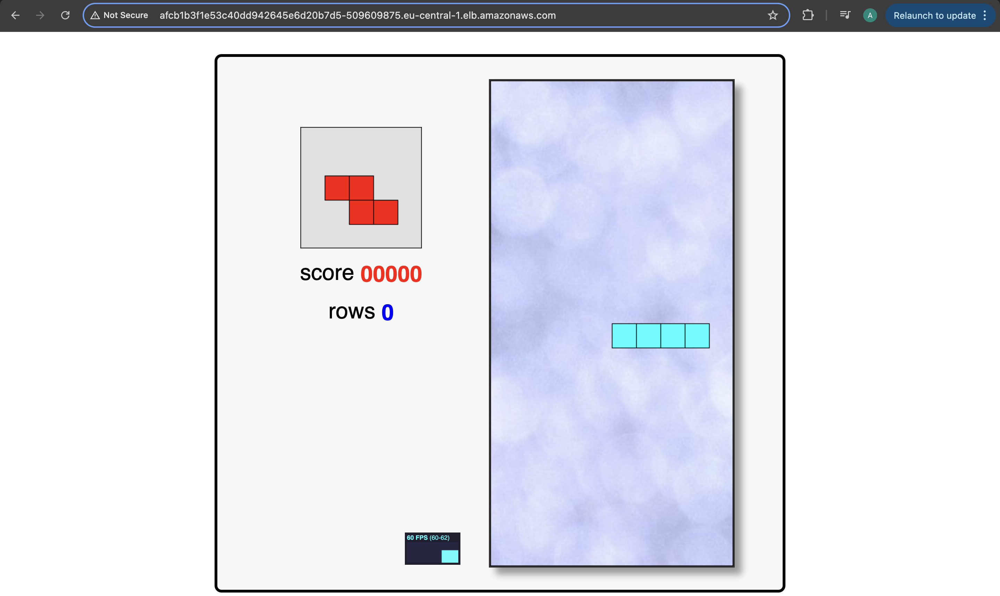
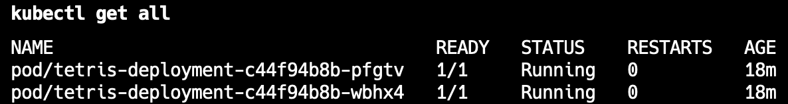
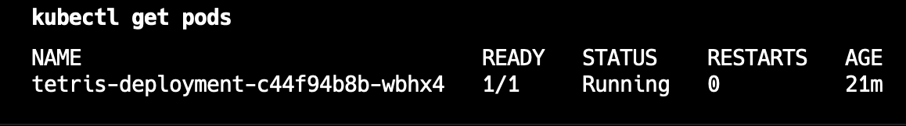

# Deploy Tetris Game on EKS cluster using ArgoCD


### Project Overview

This project demonstrates how to deploy a Tetris game on an Amazon EKS cluster using ArgoCD for continuous delivery. The main goal is to learn how to manage, automate, and monitor Kubernetes-based applications using GitOps principles. You will gain hands-on experience in:

- Provisioning and managing an EKS Cluster in AWS.
- Configuring and managing node groups for application support.
- Managing Kubernetes context settings for cluster interaction.
- Installing and configuring ArgoCD for automated deployments.
- Implementing a GitOps workflow with ArgoCD for seamless application updates.
- Deploying, updating, and scaling applications using ArgoCD.

By the end, you'll understand how to effectively deploy and manage Kubernetes applications using ArgoCD in a production-like environment.

## Steps

1. **Launch EKS cluster**

2. **Add Node Group**

3. **Set up context**
```bash
aws eks update-kubeconfig --name Tetris --region eu-central-1
```
4. **Install ArgoCD:**
    You can install ArgoCD on your Kubernetes cluster by following the instructions provided in the [EKS Workshop](https://archive.eksworkshop.com/intermediate/290_argocd/install/) documentation.

5. **Set Your GitHub Repository as a Source:**
    After installing ArgoCD, you need to set up your GitHub repository as a source for your application deployment. This typically involves configuring the connection to your repository and defining the source for your ArgoCD application. The specific steps will depend on your setup and requirements.

   Connect GitHub Repository:
   

6. **Create an ArgoCD Application:**
   - `name`: Set the name for your application.
   - `destination`: Define the destination where your application should be deployed.
   - `project`: Specify the project the application belongs to.
   - `source`: Set the source of your application, including the GitHub repository URL, revision, and the path to the application within the repository.
   - `syncPolicy`: Configure the sync policy, including automatic syncing, pruning, and self-healing.
  
  ArgoCD Application:
  ```yml
  apiVersion: argoproj.io/v1alpha1
  kind: Application
  metadata:
    name: tetris
  spec:
    destination:
      name: ''
      namespace: default
      server: 'https://kubernetes.default.svc'
    source:
      path: manifests
      repoURL: 'https://github.com/ArtemAivazian/tetris-game.git'
      targetRevision: HEAD
    project: default
    syncPolicy:
      automated:
        prune: false
        selfHeal: false
  ```
  
  
  Tetris 1st version:
  

7. **Automated Deployment of the 2nd version of the Tetris using ArgoCD**
  ```yaml
  # tetris-deployment.yaml

  apiVersion: apps/v1
  kind: Deployment
  metadata:
    name: tetris-deployment
  spec:
    replicas: 2
    selector:
      matchLabels:
        app: tetris
    template:
      metadata:
        labels:
          app: tetris
      spec:
        containers:
          - name: tetris
            image: nasi101/tetrisv2  # Replaced with 'nasi101/tetrisv2' - 2nd version
            ports:
              - containerPort: 80
  ```

2nd version of the app:


8. **Decrease number of pods**
 ```yml
  # tetris-deployment.yaml

  apiVersion: apps/v1
  kind: Deployment
  metadata:
    name: tetris-deployment
  spec:
    replicas: 1  # Set to 1 replica
    selector:
      matchLabels:
        app: tetris
    template:
      metadata:
        labels:
          app: tetris
      spec:
        containers:
          - name: tetris
            image: nasi101/tetrisv2
            ports:
              - containerPort: 80
  ```

Before 2 (replica):


After (1 replica):
